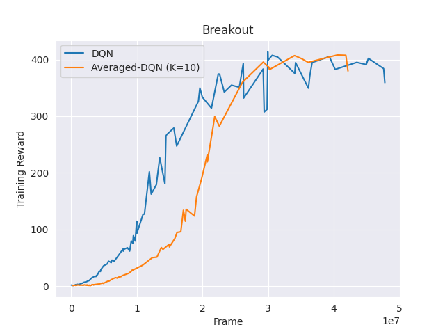
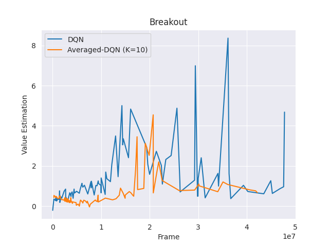
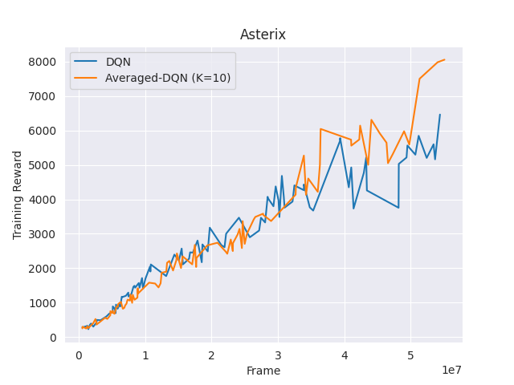
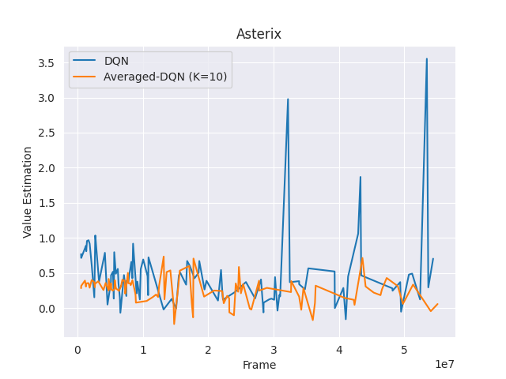

# PyTorch Implementations of DQN / Averaged-DQN

This repository contains implementations of [DQN from Minh et al.](https://www.nature.com/articles/nature14236) and [Averaged-DQN from Anschel et al.](https://arxiv.org/abs/1611.01929). The code is developed based on a well-written DQN framework [here](https://github.com/jacobaustin123/pytorch-dqn?fbclid=IwAR1dHI4btERitaWTPjZ0qEw9vknLwZdTK34HL5wjnkYN9uSvxI5E3tuY27k).

## Environment
Please refer to requirements.txt.
To use atari-py, you need to download the [ROMs.rar](http://www.atarimania.com/rom_collection_archive_atari_2600_roms.html) first, unrar it to get ROMs.zip, and again unzip ROMs.zip to get ROMs folder.
Next, run 
`python -m atari_py.import_roms <path to ROMs folder>`
to setting the ROMs.

You may also follow the original [document](https://github.com/openai/atari-py#roms) of atari-py.

## Usage

To train the model, run `python dqn.py --weights [pretrained weights]`. Various hyperparameters can be set in `dqn.py`. Good pretrained weights are provided in the weights directory, but you can also train from scratch. Experiments are saved in the `experiments` directory by default.

## Training Details

The details of the DQN implementation make a huge difference on performance. The following guidelines were helpful in achieving good error:

1. The original paper was ambiguous about frame skipping in the environment. I originally thought the Q-network was fed the past 4 frames (ignoring frame skipping), but in fact it is fed the past 4 observed frames on top of frame skipping, so essentially the current frame, T, T-4, T-8, and T-12 with the default skip size of 4. 
2. Considering loss of life to be the end of an episode for rewards was helpful (i.e. mark any frame on which loss of life occurs as terminal, but don't reset the environment).
3. The large replay memory can be fit into a reasonable GPU or CPU memory (8GB) by storing frames as unsigned integers and by storing the original and subsequent state in the same cache. Essentially, just save all frames once in an array and sample from it as needed. This implementation also supports a memory cache split over multiple devices, but this was ultimately not needed.
4. Using the Adam optimizer was perfectly fine, instead of RMSProp. See the hyperparameters used in this implementation for reference. Faster learning rates worked better for easy tasks like Pong.
5. I personally annealed epsilon from 1 to 0.1 in 1 million frames, and then to 0.01 over the next 30 million frames. This worked fine, but other methods anneal to 0.01 much faster.

## Results
Training Reward |  Q Value Estimation
:-------------------------:|:-------------------------:
 | 
 | 

